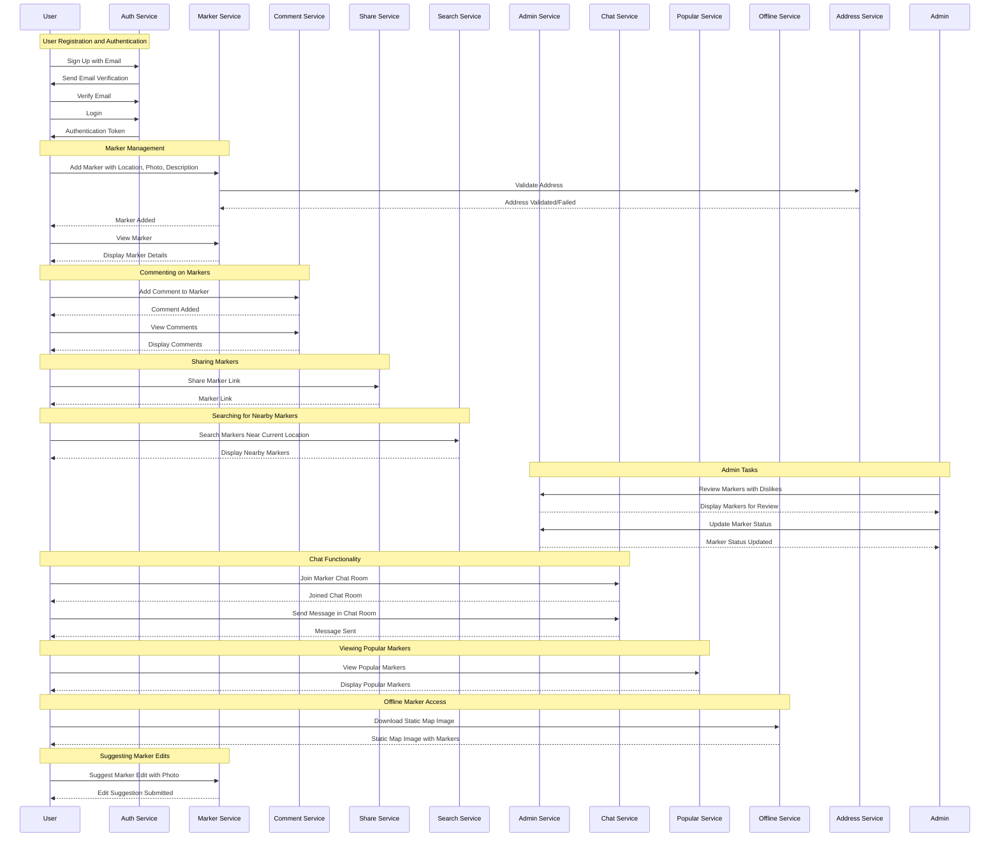

# chulbong- :kr:

   
  
  
  
  
  

> [!NOTE]  
> The service is running with [Go as backend](https://github.com/Alfex4936/chulbong-kr/tree/main/backend) but [Spring boot 3](https://github.com/Alfex4936/chulbong-kr/tree/main/backend-spring) is also available. (WIP)

   

### 프로젝트 소개 :world_map:

**k-pullup**은 공공장소에 있는 턱걸이 바를 찾고 공유하기 위한 커뮤니티 플랫폼입니다.

지도 API를 활용하여 사용자는 가입 및 로그인 후 턱걸이 바의 위치를 마커로 추가할 수 있으며,

사진 한 장과 간단한 설명을 함께 업로드할 수 있습니다.

로그인한 다른 사용자는 해당 마커에 댓글을 남길 수 있어, 정보 공유 및 소통이 용이합니다.

- 백엔드
  - https://github.com/Alfex4936/chulbong-kr
- 프론트엔드
  - https://github.com/2YH02/k-pullup

## 🖼️ 구현 UI

|      메인 화면      |      검색 (주변 검색, 초성 지원)      |      위치 채팅      |
|:-------------------:|:----------------------------------:|:-------------------:|
|  |  |  |

|  거리뷰 (가장 가까운 위치)  |      댓글      |    오프라인 저장 (카카오맵)     |
|:-------------------:|:-------------:|:-----------------------------:|
|  |  |  |

|   공유, 북마크   |  이미지 상세  |    위치 등록    |
|:----------------:|:-------------:|:---------------------:|
|  |  |  |

|   위치 삭제   |    지도 이동   |  마이페이지, 설정  |
|:-------------:|:-------------:|:--------------------:|
|  |  |  |

|   정보 수정 요청   |   수정 요청 승인  |  반응형  |
|:-------------:|:-------------:|:-------------:|
|  |  |  |

### 기능

- **회원가입 및 로그인**: 사용자 인증을 위한 기본적인 회원가입 및 로그인 기능. (이메일 인증 or 소셜 로그인)
  - Google/Naver/Kakao 지원
- **마커 추가**: 턱걸이 바의 위치를 지도에 마커로 표시. 사진과 간단한 설명을 포함할 수 있음.
- **댓글 기능**: 로그인한 사용자는 각 마커에 댓글을 남길 수 있어 정보 공유가 가능.
- **마커 공유**: 특정 마커 공유 버튼을 눌러서 링크를 공유가 가능.
- **근처 턱걸이 바 검색**: 현재 화면 중앙 위치에서 가까운 턱걸이 바를 찾을 수 있는 기능.
- **필터링**: 신뢰 기반이지만 기본 필터링을 거침
  - 주소 없는 경우 DB 기록
  - 대한민국 육지 내에서만 가능
  - 사진 AI 모델
  - 위치 추가 제한 구역 설정
  - 욕설
- **채팅**: 각 마커마다 채팅 방 + 지역별 채팅 방 (익명)
- **인기 장소 확인**: 사용자들이 실시간 자주 방문하는 인기 턱걸이 바 위치 확인 기능. (현재 위치 기준 + 전국)
- **정적 이미지 오프라인**: 오프라인 용도로 철봉 위치들을 PDF로 저장할 수 있는 기능. (카카오맵 정적 이미지 보완)
- **마커 장소 검색**: 등록된 마커들의 주소 검색 기능
  - 초성 검색: ㅅㅇㅅ -> "수원시"
  - 전국 5대 지하철 역 검색 가능: "서울대입구역" -> 주변 2km 반경 철봉들 불러옴
  - QWERTY 한글: rPfyd -> "계룡"
- **정보 수정 제안**: 등록된 마커들의 정보 수정 제안 기능 (사진 1장 필수)

### TODO 아이디어

- **커뮤니티 포럼**: 사용자들이 운동 팁, 턱걸이 바 추천 등을 공유할 수 있는 커뮤니티 공간.
- **이벤트 및 챌린지**: 사용자들이 참여할 수 있는 운동 관련 이벤트 및 챌린지 개최.

### pullup/dips bar detection

"A nimble AI model, trained on 700 images in August 2024, striving to expertly detect bars with precision." (YOLO v8)

### 기술 스택

https://github.com/Alfex4936/chulbong-kr/assets/2356749/913b113c-4a8d-4df1-bb5a-83f6babf7475

- **백엔드**: Go언어 Fiber v2, MySQL, AWS S3, LavinMQ (RabbitMQ), Redis, Bleve (Apache Lucene-like, ZincSearch에서 직접 검색 인덱싱으로 변경)
  - 메인: Go, 서브: Java (전체 프로젝트 자바로도 작성 중)
- **프론트엔드**: NextJS (TypeScript), Tailwind css, Storybook, Zustand, Yarn Berry
- **개발 & 운영 효율성**: pprof, flamegraph, Uber's zap logger, Swagger OpenAPI, Prometheus+Grafana
- **AI**: YOLO v8, gpt-4o mini
- **협업**: Slack (+ Slack API)

### 🚀 Project Roles 🚀

- **Backend Development**  
  👨‍💻 [@Alfex4936](https://github.com/Alfex4936)

- **Frontend Development**  
  🎨 [@2YH02](https://github.com/2YH02)

> [!NOTE]
> 대부분 철봉 위치 데이터는 [chulbong.kr](https://chulbong.kr/) 에서 가져왔음을 알립니다. (2차 필터링)

### Data analysis (2024 June ~ 2024 Nov)

