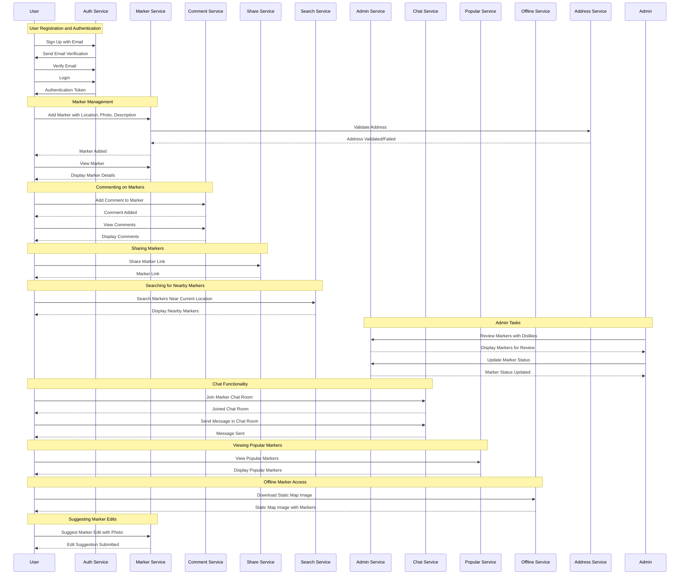

# chulbong- :kr:

   
  
  

> [!NOTE]  
> The service is running with [Go as backend](https://github.com/Alfex4936/chulbong-kr/tree/main/backend) but [Spring boot 3](https://github.com/Alfex4936/chulbong-kr/tree/main/backend-spring) is also available. (WIP)

   

### Project Introduction :world_map:

**chulbong-kr** is a community platform for finding and sharing pull-up bars in public places.

Using the map API, users can add markers for pull-up bar locations after signing up and logging in, and can upload a photo and a brief description.

Other logged-in users can leave comments on these markers, making it easy to share information and communicate.

|                                                                                                                                                                 |                                                                                                                                                                  |
| :-------------------------------------------------------------------------------------------------------------------------------------------------------------: | :--------------------------------------------------------------------------------------------------------------------------------------------------------------: |
|            Main Screen           |              Marker Information     |
|  Street View (nearest)      |              Comments         |
|           Nearby Pull-up Bars |  Offline Storage (KakaoMap) |
|           Pull-up Bar Address Search (Initials Supported)          |  Suggest Information Edit |

### Features

- **Sign Up and Login**: Basic sign-up and login functionality for user authentication. (Email verification required)
- **Add Marker**: Mark the location of pull-up bars on the map. You can include a photo and a brief description.
- **Comment Feature**: Logged-in users can leave comments on each marker to share information.
- **Share Marker**: You can share the link by pressing the share button on a specific marker.
- **Search Nearby Pull-up Bars**: Function to find pull-up bars near the current central position of the screen.
- **Admin**: Automatic first filtering (recorded in the database if no address) + review markers with a certain number of dislikes.
- **Chat**: Chat rooms for each marker + regional chat rooms (anonymous).
- **View Popular Locations**: Function to check the locations of popular pull-up bars that users frequently visit in real-time. (Based on the current location + nationwide)
- **Offline Static Image**: Function to save pull-up bar locations for offline use. (Supplemented with KakaoMap static images)
- **Search Marker Locations**: Function to search for the addresses of registered markers (supports initials).
- **Suggest Information Edit**: Function to suggest edits to the information of registered markers (requires one photo).

### TODO Ideas

- **Community Forum**: A community space where users can share workout tips, recommend pull-up bars, and more.
- **Events and Challenges**: Hosting workout-related events and challenges for users to participate in.

### Technology Stack

https://github.com/Alfex4936/chulbong-kr/assets/2356749/913b113c-4a8d-4df1-bb5a-83f6babf7475

- **Backend**: Go language Fiber v2, MySQL, AWS S3, LavinMQ (RabbitMQ), Redis, Bleve (Apache Lucene-like, replaced with direct search indexing in ZincSearch)
  - Main: Go, Sub: Java (the entire project is also being written in Java)
- **Frontend**: React -> NextJS (TypeScript)
- **Development & Operational Efficiency**: pprof, flamegraph, Uber's zap logger, Swagger OpenAPI, Prometheus+Grafana
- **Collaboration**: Slack (+ Slack API)

### 🚀 Project Roles 🚀

- **Backend Development**  
  👨‍💻 [@Alfex4936](https://github.com/Alfex4936)

- **Frontend Development**  
  🎨 [@2YH02](https://github.com/2YH02)

> [!NOTE]
> Most pull-up bar location data was obtained from [chulbong.kr](https://chulbong.kr/) (second filtering)