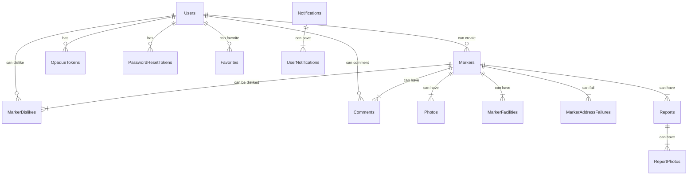

# chulbong-:kr:

## Technologies and Frameworks

Below is the list of technologies and frameworks used in the Chulbong-KR backend:

- **Programming Language**: Go v1.22.3
- **Web Framework**: Fiber v2
- **Database**: MySQL 8
- **Caching**: Dragonfly (Redis-compatible)
- **Search Engine**: ZincSearch (Elasticsearch-compatible)
- **Chatting**: gorilla Websocket

## Dependency Management

- **Dependency Injection**: The project utilizes [Uber Fx](https://github.com/uber-go/fx) for managing dependencies effectively, following best practices in modularity and maintainability.

## Coding Conventions

- **Standards Followed**:
  - Google's Go programming language conventions
  - Uber's Go style guide

## Code Quality

- **Linter Configuration**:
  - See `revive.toml` for the linter settings used to ensure code quality and consistency across the project.
